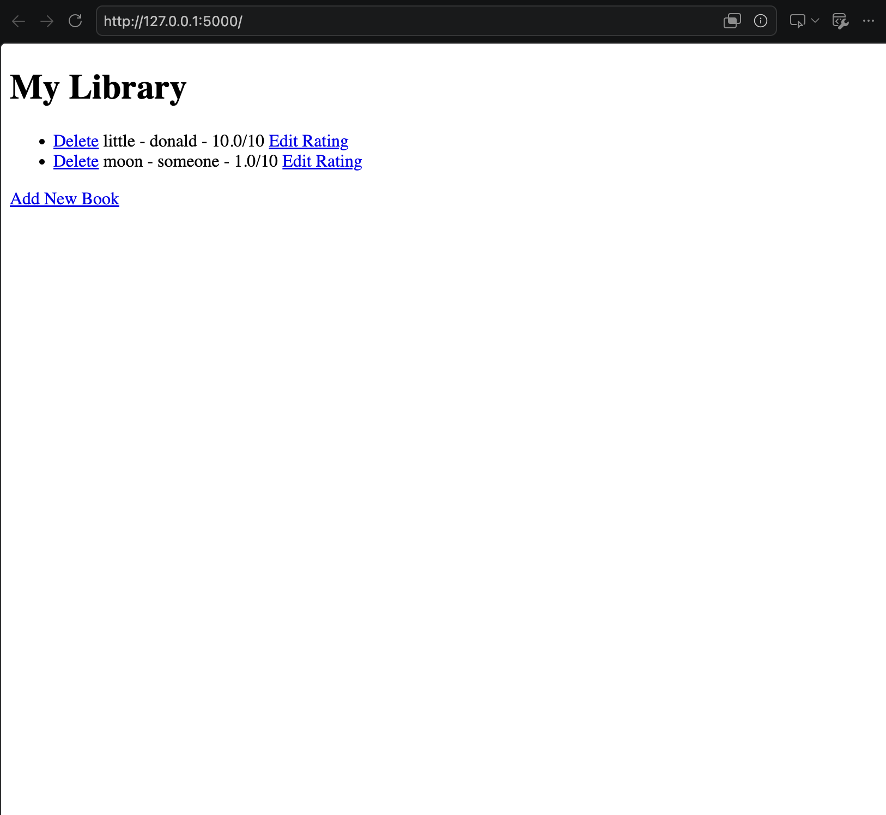
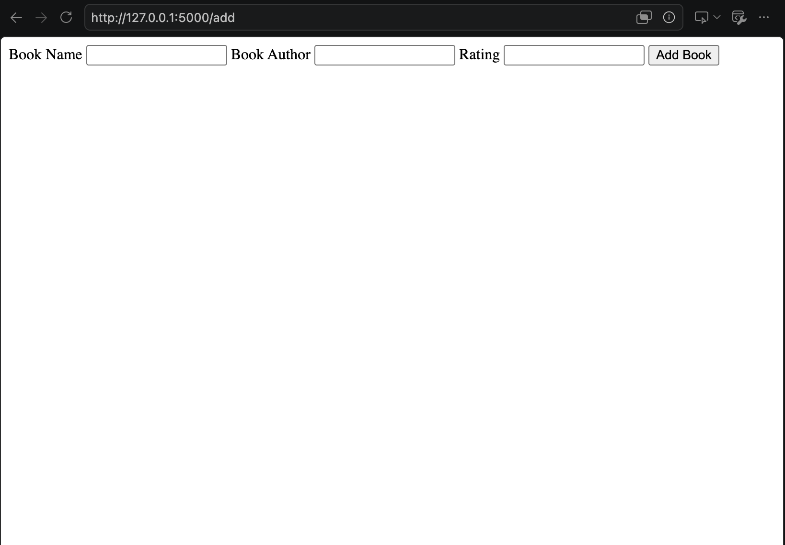

# Book Library Manager

A Python web application built with Flask and SQLAlchemy for managing a collection of books. You can add new books, edit their ratings, and delete books from the library. The data is persisted in a local SQLite database (`books.db`).

## Features

- **Home Page**: Displays all books in the library ordered alphabetically by title, showing the title, author, and rating.
- **Add Book**: A form to add a new book specifying its title, author, and rating.
- **Edit Rating**: Quick links to modify the rating of any existing book.
- **Delete Book**: Easily remove a book from the library.

---

## Screenshots & Demo

Add screenshots of your application in action below. Place your image files in a folder (e.g., a `screenshots/` directory) and link them like this:

### Home Screen
<!-- Replace "screenshots/home.png" with the path to your actual screenshot -->


### Add Book Page
<!-- Replace "screenshots/add_book.png" with the path to your actual screenshot -->


---

## Prerequisites

Make sure you have Python installed. You can install all dependencies using pip:

```bash
pip install -r requirements.txt
```

## Running the Application

1. Run the Flask application:
   ```bash
   python main.py
   ```
2. Open your web browser and go to:
   ```
   http://127.0.0.1:5000/
   ```

---

## Viewing the Database (`books.db`)

All the book records are stored in the `books.db` SQLite database file in the project's root folder. 

To view, browse, and edit the raw database tables manually:
1. Download and install **DB Browser for SQLite** (a free, open-source visual tool) from the official website: [https://sqlitebrowser.org/](https://sqlitebrowser.org/).
2. Open **DB Browser for SQLite**.
3. Click on the **Open Database** button at the top.
4. Select the `books.db` file located in this project directory.
5. Go to the **Browse Data** tab to view the `books` table records, or use the **Execute SQL** tab to run queries directly.
